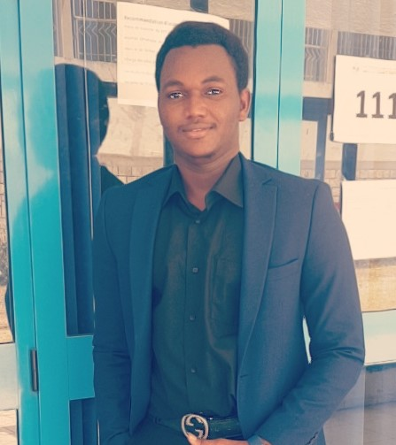

---
---

<link rel="stylesheet" href="styles.css" type="text/css">
---

---

# {.tabset .tabset-fade .tabset-pills}

## About me

My name is Beogo Eric, I am 22 years of Burkinabe nationality. I am a student in the last year at the Higher School of Statistics and Information Analysis, the only statistical engineering school in Tunisia. I am also a student in research master at the national engineering school of Tunis.

---

## goals and motivations

##skills

## contact me

---
---

<link rel="stylesheet" href="styles.css" type="text/css">

I'd love to hear from you, so feel free to follow me on GitHub, facebook, or Linkedin (links in top right).  

or you have my phone number :  
+21654275498

You can also <a href="mailto:beogoe6@gmail.com?subject=Hello!">email me</a>. I love meeting new people so don't hesitate to send a message!

I am a student in Statistics.   I use a lot R, Python  and Shiny for research projects. So feel free to get in touch if you want to discuss potential projects, your Statistical modeling  needs, or Shiny apps.

